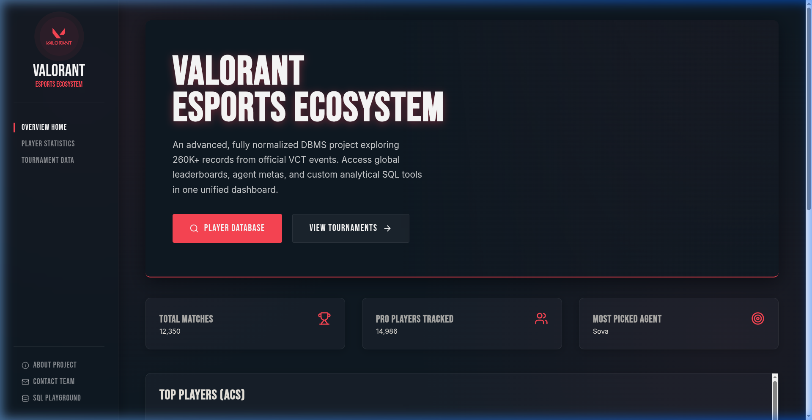
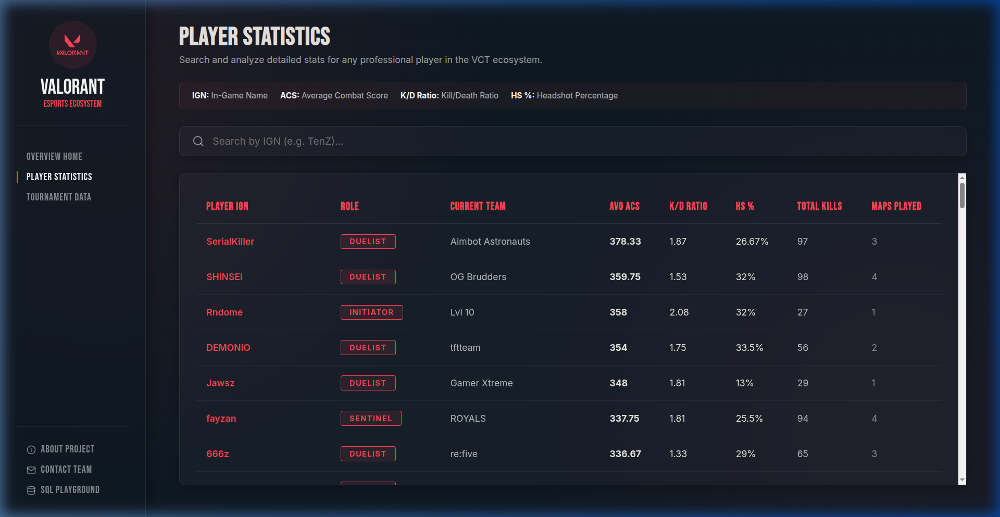
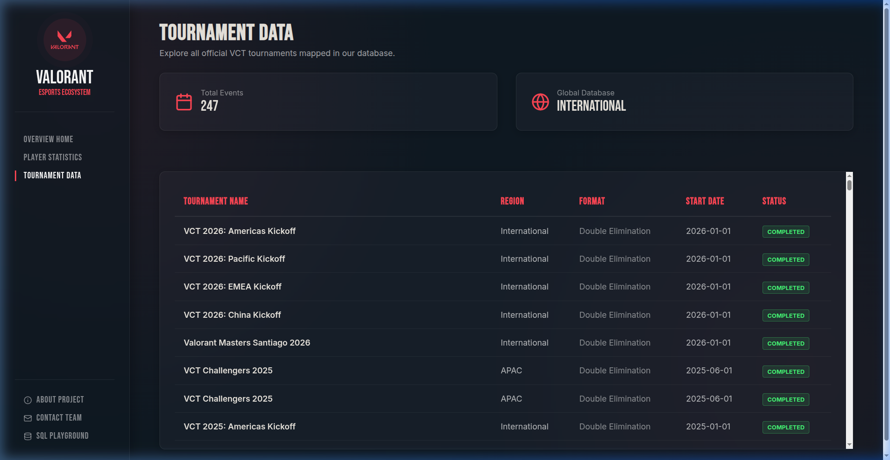
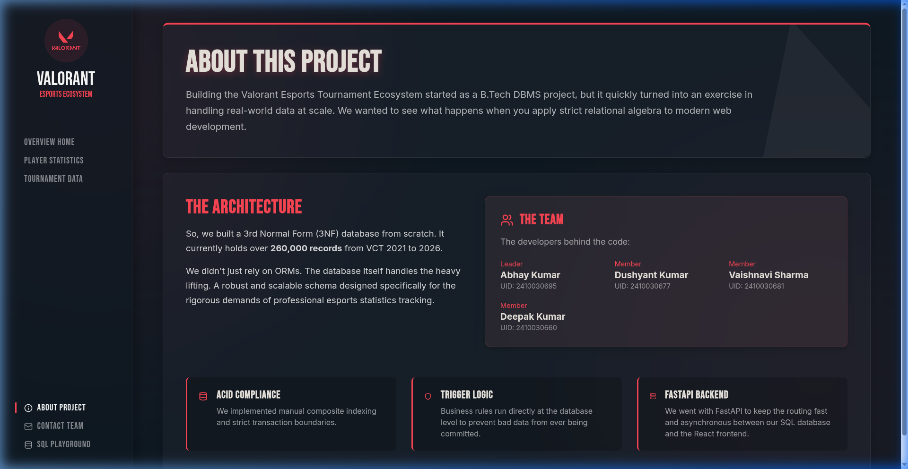
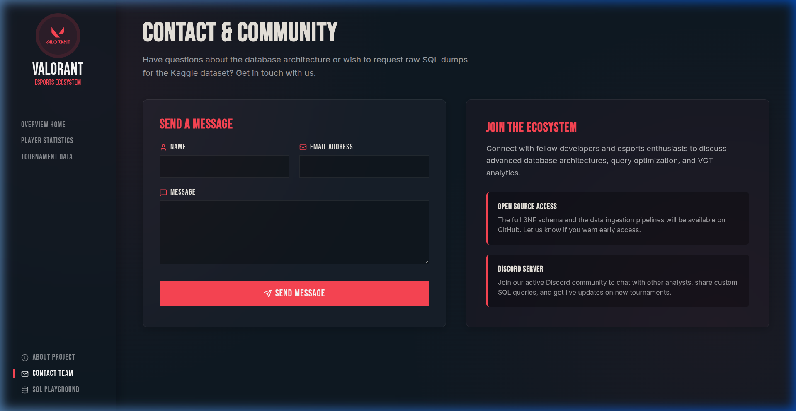
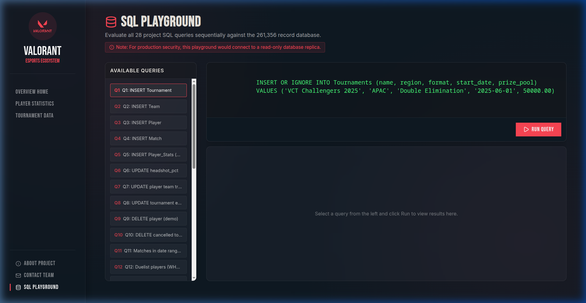

# Valorant Esports Tournament Ecosystem

A full stack DBMS project that processes, stores, and queries 261,356 records from official VCT (Valorant Champions Tour) events spanning 2021 through 2026.

We built this for our 4th semester DBMS course. The idea was straightforward: take the messy, redundant CSV data floating around Kaggle and organize it into a proper 3NF relational schema. Then wire up a React dashboard so you can actually see what the data looks like when it is clean.

## Screenshots

The dashboard runs locally on `localhost:5173`. Here is what each tab looks like:

### Overview

The landing page. Three stat cards at the top pull live aggregates from the database, followed by the player leaderboard and agent meta tables.



### Player statistics

Searchable table backed by the `vw_player_leaderboard` view. The glossary bar at the top explains what IGN, ACS, K/D, and HS% mean.



### Tournament data

Every VCT event in the database, sorted by date. All tournaments show "Completed" because the dataset only contains finished events.



### About

Project background, architecture notes, and the team roster.



### Contact

A contact form and community links. The form simulates submission with a 1.2-second delay.



### SQL playground

Run any of the 28 project queries (or your own) directly against the live SQLite database. Results render in a scrollable table below the editor.



## What it does

The database tracks tournaments, teams, players, match results (broken down by individual maps), and per-map player statistics. Six tables, all normalized to 3NF, connected by foreign keys with proper cascade rules.

The frontend is a single page React app that talks to a Python FastAPI backend. You get:

- A dashboard with aggregate stats (total matches, player count, most picked agent)
- A searchable player statistics table pulling from a materialized view
- A tournament browser showing every VCT event in the dataset
- An interactive SQL playground where you can run any of the 28 required project queries directly against the live database

The SQL playground runs live queries. It is connected to the same SQLite database that powers the rest of the app.

## Tech stack

- **Database:** SQLite3 with raw SQL for all DDL, triggers, procedures, and queries
- **Backend:** Python 3 with FastAPI. Six REST endpoints serving JSON to the frontend
- **Frontend:** React 19, Vite 8, plain CSS. No component libraries. Styled with the official VCT color palette (#0F1923 and #FF4655)

## Running it locally

You need Python 3.10+ and Node.js 18+.

**Backend:**
```bash
cd backend
pip install fastapi uvicorn pydantic
python3 app.py
```
The API starts on `http://localhost:8000`.

**Frontend:**
```bash
cd frontend
npm install
npm run dev
```
The dashboard opens at `http://localhost:5173`.

The SQLite database file (`valorant_esports.db`) is included in the repo, so you do not need to run any data ingestion scripts. Everything works out of the box.

## Database features

- 6 tables in 3NF (Tournaments, Teams, Players, Matches, Match_Maps, Player_Stats)
- 1 view (vw_player_leaderboard) for leaderboard aggregations
- 5 triggers enforcing business rules (roster lock during active tournaments, self-match prevention, winner validation, map winner validation, empty agent check)
- 4 stored procedures (player stats lookup, tournament leaderboard, match registration, agent meta report)
- 5 indexes on frequently queried columns
- ACID-compliant transactions for multi-table inserts
- DDL examples (ALTER TABLE for schema evolution)
- DCL examples (GRANT/REVOKE for role-based access control)

## Project structure

```
.
├── backend/
│   └── app.py                 # FastAPI server
├── frontend/
│   ├── src/
│   │   ├── App.jsx            # Main app with routing
│   │   ├── index.css          # Global styles (VCT theme)
│   │   └── components/        # React components
│   └── public/                # Static assets
├── docs/                      # Task PDFs
├── screenshots/               # Dashboard screenshots
├── schema.sql                 # MySQL-compatible DDL
├── advanced_queries.sql       # Indexes, triggers, SPs, transactions, DCL
└── valorant_esports.db        # Pre-populated SQLite database
```

## The team

- **Abhay Kumar** (2410030695) - Group Leader
- **Dushyant Kumar** (2410030677)
- **Vaishnavi Sharma** (2410030681)
- **Deepak Kumar** (2410030660)

B.Tech Computer Science and Engineering, 4th Semester, 2025-2026
